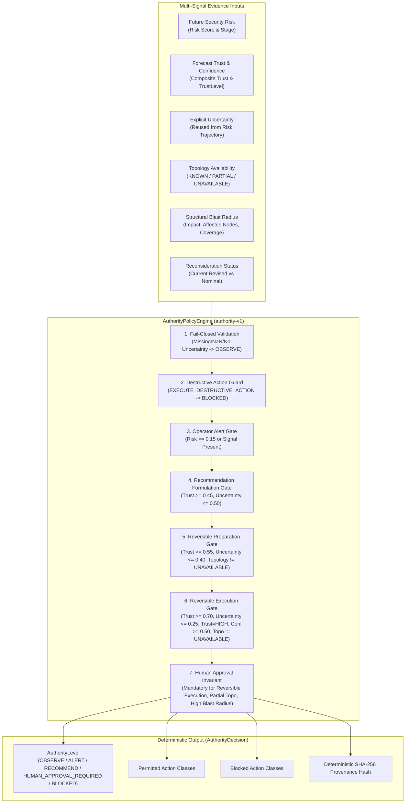

# Confidence → Authority Policy Architecture & Specification (Task 20)

## 1. Executive Summary & Core Philosophy

In automated cyber-defense and security intelligence pipelines, a frequent failure mode is conflating **threat intensity** with **operational authority**:
$$\text{High Risk} \neq \text{High Authority}$$

When a model observes or forecasts high risk with low model trust, high uncertainty, or degraded topology visibility, autonomous action is hazardous. Aggressive automated containment based on speculative forecasts risks severe collateral damage (e.g. severing legitimate enterprise traffic or dropping database connections).

**Authority is an operational permission granted by evidence quality and conservative policy constraints**, not by risk magnitude. High risk increases urgency and alerts operators; it strictly does *not* grant autonomous execution authority without verified evidence.



---

## 2. Authority Levels & Action Classes

### 2.1 Explicit Authority Levels (`AuthorityLevel`)

| Authority Level | Definition & Operational Scope |
| :--- | :--- |
| `OBSERVE` | The system records telemetry, updates buffers, and monitors state. No active notifications or external changes are justified. |
| `ALERT` | The system is authorized to surface warnings to security analysts/operators. Signal indicates potential abnormality, but evidence quality does not justify automated mitigation proposals. |
| `RECOMMEND` | The system is authorized to formulate and present structured defensive recommendations with suggested actions. |
| `HUMAN_APPROVAL_REQUIRED` | The system is authorized to stage or prepare containment actions, but **explicit operator approval is mandatory** prior to any enforcement. |
| `BLOCKED` | The requested action class is explicitly prohibited under current evidence quality or invariant constraints. |

### 2.2 Operational Action Classes (`ActionClass`)

| Action Class | Category | Autonomy Prerequisites |
| :--- | :--- | :--- |
| `OBSERVE_ONLY` | Passive | Nominal telemetry ingest (always permitted unless input is unparseable). |
| `ALERT_OPERATOR` | Informational | Risk score $\ge 0.15$, stage confidence $\ge 0.30$, or affected nodes $> 0$. |
| `GENERATE_RECOMMENDATION` | Advisory | Composite trust $\ge 0.45$, `TrustLevel` $\neq$ `INSUFFICIENT`, uncertainty $\le 0.50$. |
| `PREPARE_REVERSIBLE_ACTION` | Staging | Trust $\ge 0.55$, uncertainty $\le 0.40$, recommendation permitted, topology $\neq$ `UNAVAILABLE`. |
| `EXECUTE_REVERSIBLE_ACTION` | Interventional | Trust $\ge 0.70$, uncertainty $\le 0.25$, `TrustLevel.HIGH`, stage confidence $\ge 0.50$, topology $\neq$ `UNAVAILABLE`. **Human approval strictly mandatory.** |
| `EXECUTE_DESTRUCTIVE_ACTION` | Destructive | **PERMANENTLY BLOCKED.** Automated agents and forecasting pipelines are never granted autonomous destructive execution authority. |

---

## 3. Conservative Policy Invariants

1. **Low Trust Constrains Authority**: If composite trust is low or `TrustLevel.INSUFFICIENT`, execution and recommendation gates immediately close, restricting authority to `OBSERVE` or `ALERT`.
2. **High Uncertainty Constrains Authority**: If uncertainty exceeds policy thresholds ($> 0.50$ for recommendation, $> 0.25$ for execution), speculative intervention is blocked.
3. **Unavailable Topology Blocks Execution and Preparation**: If topology is `UNAVAILABLE`, the system cannot evaluate blast radius or structural dependencies. Both `EXECUTE_REVERSIBLE_ACTION` and `PREPARE_REVERSIBLE_ACTION` are blocked.
4. **Partial Topology Mandates Human Approval**: When topology is `PARTIAL`, incomplete graph coverage mandates human review (`human_approval_required = True`).
5. **Destructive Actions Are Permanently Blocked**: `EXECUTE_DESTRUCTIVE_ACTION` is unconditionally placed in `blocked_action_classes`. If specifically requested, the decision authority level is `BLOCKED`.
6. **Blast Radius Urgency vs. Authority**: High structural blast radius ($\ge 0.70$ impact or critical affected nodes) raises operator review urgency (`HIGH_STRUCTURAL_BLAST_RADIUS_URGENCY`), but does **not** grant or expand operational authority.
7. **Fail-Closed Semantics**: If any input metric is missing, `NaN`, non-finite, out-of-bounds, or if explicit uncertainty is unavailable, the engine fails closed to `AuthorityLevel.OBSERVE` with only `OBSERVE_ONLY` permitted and code `FAIL_CLOSED_INVALID_OR_MISSING_INPUT`.

---

## 4. Uncertainty Contract: Explicit Reuse Without Synthesis

### 4.1 Strict Amendment Adherence
The policy engine strictly reuses the project's existing uncertainty contract established in `security/contracts.py` (`FutureSecurityRiskScore.uncertainty`).

> **CRITICAL RULE**: The engine does **NOT** synthesize `uncertainty = 1.0 - composite_trust`. Trust and uncertainty are distinct epistemic dimensions in this architecture:
> - **Trust** represents historical model reliability, feature coverage, and forecast calibration.
> - **Uncertainty** represents predictive dispersion, horizon variance, and signal ambiguity.

### 4.2 Horizon-Specific Uncertainty
Where available, horizon-specific uncertainties are tracked in `AuthorityPolicyInput.horizon_uncertainties` (e.g. `{0: 0.15, 1: 0.25, 2: 0.35}`).
- When evaluating current state ($h=0$), `uncertainty` is drawn directly from `risk_traj.current_risk.uncertainty`.
- When evaluating lookahead horizons ($h>0$), `horizon_uncertainties[h]` is referenced.
- If explicit uncertainty is `None` and unavailable across all horizon representations, `is_valid()` returns `False`, failing closed.

---

## 5. Monotonicity Guarantees

The engine mathematically guarantees three monotonic properties:

1. **Trust Monotonicity**: Holding all other inputs constant, increasing composite trust from $0.0 \to 1.0$ can *never* reduce the set of permitted action classes:
   $$\mathcal{A}_{\text{perm}}(T_1) \subseteq \mathcal{A}_{\text{perm}}(T_2) \quad \forall \; T_1 \le T_2$$
2. **Uncertainty Monotonicity**: Holding all other inputs constant, increasing uncertainty from $0.0 \to 1.0$ can *never* expand the set of permitted action classes:
   $$\mathcal{A}_{\text{perm}}(U_2) \subseteq \mathcal{A}_{\text{perm}}(U_1) \quad \forall \; U_1 \le U_2$$
3. **Topology Completeness Monotonicity**: Improving topology completeness from $\text{UNAVAILABLE} \to \text{PARTIAL} \to \text{KNOWN}$ can *never* reduce permitted action classes:
   $$\mathcal{A}_{\text{perm}}(\text{UNAVAILABLE}) \subseteq \mathcal{A}_{\text{perm}}(\text{PARTIAL}) \subseteq \mathcal{A}_{\text{perm}}(\text{KNOWN})$$

---

## 6. Closed-Loop Reconsideration Integration

Task 17 introduced first-class forecast reconsideration (`ReconsiderationEngine`). When newly arrived observations conflict with prior forecasts, the pipeline re-runs to produce revised trust, revised risk, revised priority, and revised hypotheses.

The `AuthorityPolicyEngine` evaluates **exclusively against the current revised outputs**:
- `risk_score` is drawn from `curr_risk_val` (updated to `rev_risk_traj.current_risk.score` if revised).
- `composite_trust` is drawn from `trust_val` (updated to `rev_trust.composite_trust` if revised).
- `uncertainty` is drawn from `risk_traj.current_risk.uncertainty` (updated to revised risk trajectory uncertainty).
- `is_reconsideration` is set to `recon_triggered`, recording audit code `RECONSIDERED_EVIDENCE_EVALUATED`.

The engine never evaluates against stale pre-reconsideration values.

---

## 7. Deterministic Auditability & Provenance

Every `AuthorityDecision` includes:
- `decision_id`: Unique identifier (prefixed `auth-dec-...`).
- `policy_version`: Policy revision tag (`authority-v1`).
- `reason_codes`: Deterministic audit flags explaining every gate pass or block.
- `provenance_hash`: SHA-256 digest over the canonical evaluation tuple:
  $$\text{SHA-256}(\text{policy\_version} \mid \text{authority\_level} \mid \text{permitted} \mid \text{blocked} \mid \text{human\_approval\_required} \mid \text{reason\_codes})$$

Dynamic identifiers such as UUIDs and wall-clock timestamps are omitted from the canonical preimage, ensuring complete mathematical determinism and replay verification.

---

## 8. DemoEvent & Streaming Integration

`DemoEvent` includes the first-class `authority_policy` field:
```json
{
  "event_id": "evt-0002-e1a2b3c4",
  "step_index": 2,
  "logical_time_str": "T02 (020s)",
  "current_risk_score": 0.42,
  "composite_trust": 0.82,
  "authority_policy": {
    "decision_id": "auth-dec-a1b2c3d4",
    "authority_level": "HUMAN_APPROVAL_REQUIRED",
    "permitted_action_classes": [
      "OBSERVE_ONLY",
      "ALERT_OPERATOR",
      "GENERATE_RECOMMENDATION",
      "PREPARE_REVERSIBLE_ACTION",
      "EXECUTE_REVERSIBLE_ACTION"
    ],
    "blocked_action_classes": [
      "EXECUTE_DESTRUCTIVE_ACTION"
    ],
    "human_approval_required": true,
    "policy_version": "authority-v1",
    "reason_codes": [
      "DESTRUCTIVE_ACTIONS_PERMANENTLY_BLOCKED",
      "SIGNIFICANT_SIGNAL_PERMITS_ALERT",
      "ADEQUATE_TRUST_PERMITS_RECOMMENDATION",
      "REVERSIBLE_PREPARATION_AUTHORIZED",
      "STRONG_EVIDENCE_PERMITS_HUMAN_GATED_EXECUTION"
    ],
    "explanation": "Authority decision 'HUMAN_APPROVAL_REQUIRED' under policy authority-v1: ...",
    "provenance_hash": "e3b0c44298fc1c149afbf4c8996fb92427ae41e4649b934ca495991b7852b855",
    "created_at": "2026-09-06T00:40:00.000000"
  }
}
```

---

## 9. Governance & Operational Safeguards

1. **No Autonomous Execution**: This policy engine decides *what authority is justified*. It does not execute actions or change firewalls directly.
2. **Human-in-the-Loop Constraint**: All operational interventions remain human-gated (`human_approval_required = True`).
3. **No Financial or Damage Claims**: Blast radius heuristics represent structural graph connectivity, not business loss calculations or validated probabilities.
