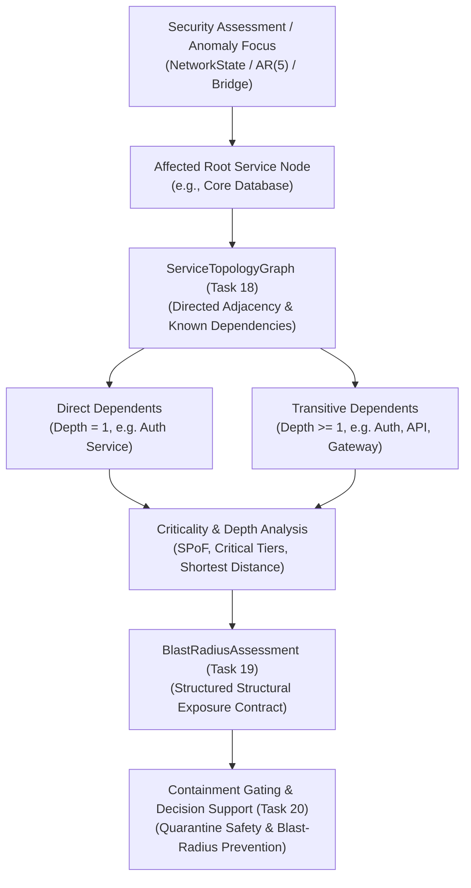

# Blast Radius & Impact Analysis Architecture (Task 19)

## 1. Executive Summary

Task 19 establishes a first-class **Blast Radius & Impact Analysis** layer within the SIH PS 26153 operational intelligence pipeline. 

Consuming the directed service topology graph established in Task 18, this layer answers the critical operational question:
> **“If service/asset $X$ becomes the focus of a forecasted or observed security event, what other services/assets are structurally exposed to downstream disruption according to the known dependency graph, and what is the criticality of that affected scope?”**



---

## 2. Core Conceptual Distinctions

To ensure scientific and operational defensibility against national-level scrutiny, the system maintains strict distinctions between separate concerns:

1. **Security Assessment**: “How anomalous or severe is the telemetry signal or future forecast trajectory?”
2. **Topology**: “Which service relies on which other service?”
3. **Blast Radius**: “Given an affected root node, which downstream services are structurally exposed to impact based on the known dependency graph?”
4. **Criticality Breakdown**: “How mission-critical are those exposed downstream services?”

### 2.1 Structural Impact vs. Attack-Propagation Probability
> [!IMPORTANT]
> **Blast radius is NOT attack-propagation probability.**
> The blast-radius engine does **not** estimate the likelihood of an attacker successfully pivoting or compromising downstream assets (e.g. no claims of *"80% chance of database compromise"*). 
> 
> Instead, it communicates **structural dependency reachability**: if service $X$ degrades or is isolated, the identified downstream services will suffer operational impairment because they depend on $X$.

### 2.2 Exclusion of Business / Economic Loss Models
The project does not fabricate arbitrary monetary figures (e.g., "downtime cost in dollars/rupees"). The impact score is strictly a **structural impact heuristic** derived from normalized topology criticality.

---

## 3. Data Models (`core/blastradius/models.py`)

### 3.1 `BlastRadiusStatus` Enum
| Status | Semantic Meaning |
|---|---|
| `COMPLETE` | Evaluated against fully `KNOWN` topology; root resolved with complete visibility. |
| `PARTIAL` | Evaluated against `PARTIAL` topology; coverage is incomplete/indeterminate. |
| `UNAVAILABLE` | Topology is `UNAVAILABLE`; structural impact cannot be evaluated (unknown, not zero). |
| `ROOT_NOT_FOUND` | Root node identifier does not exist in the topology graph; no fabrication. |

### 3.2 `BlastRadiusAssessment` Contract
An immutable frozen dataclass providing a complete audit record:

| Field | Type | Description |
|---|---|---|
| `assessment_id` | `str` | Unique assessment UUID (`new_id("blast")`). |
| `root_node_id` | `str` | Target service evaluated as the focus of the event. |
| `topology_snapshot_id` | `str` | Snapshot identifier of the evaluated graph. |
| `topology_availability` | `TopologyAvailability` | Availability state (`KNOWN`, `PARTIAL`, `UNAVAILABLE`). |
| `status` | `BlastRadiusStatus` | Analysis status (`COMPLETE`, `PARTIAL`, `UNAVAILABLE`, `ROOT_NOT_FOUND`). |
| `direct_dependent_ids` | `tuple[str, ...]` | Immediate downstream dependents ($\text{depth} = 1$). |
| `transitive_dependent_ids` | `tuple[str, ...]` | All downstream dependents ($\text{depth} \ge 1$). |
| `affected_node_ids` | `tuple[str, ...]` | Total downstream dependent nodes exposed (equals transitive). |
| `affected_node_count` | `int` | Count of exposed dependents (**strictly excludes root**). |
| `node_depths` | `Mapping[str, int]` | BFS shortest-path distance from root for each affected node. |
| `maximum_dependency_depth` | `int` | Maximum dependency depth across affected nodes (0 if none). |
| `critical_affected_node_ids` | `tuple[str, ...]` | Affected nodes with `CriticalityLevel.CRITICAL` (criticality $\ge 0.85$). |
| `high_criticality_affected_node_ids`| `tuple[str, ...]` | Affected nodes with `CriticalityLevel.HIGH` ($0.65 \le \text{criticality} < 0.85$). |
| `weighted_impact_score` | `float` | Deterministic structural impact heuristic in $[0.0, 1.0]$. |
| `coverage_ratio` | `float \| None` | $1.0$ for `KNOWN`, $0.0$ for `UNAVAILABLE`/`ROOT_NOT_FOUND`, `None` (indeterminate) for `PARTIAL`. |
| `is_complete` | `bool` | `True` strictly when status is `COMPLETE`. |
| `explanation` | `str` | Transparent audit text detailing structural findings and explicit caveats. |
| `provenance_hash` | `str` | Canonical SHA-256 integrity hash. |
| `created_at` | `datetime` | Assessment timestamp. |

---

## 4. Traversal & Impact Algorithms (`core/blastradius/engine.py`)

### 4.1 Root Exclusion Invariant
The evaluated service is the *root cause / focus* of the assessment, not a dependent of itself. 
$$\text{root\_node\_id} \notin \text{affected\_node\_ids}$$
$$\text{affected\_node\_count} = |\text{transitive\_dependent\_ids}|$$

### 4.2 Shortest-Path Dependency Depth via BFS
Dependency depth is determined via Breadth-First Search (BFS) following incoming dependency edges (`get_dependents`):
- $\text{depth}(\text{root}) = 0$ (excluded from output)
- Direct dependents: $\text{depth}(v) = 1$
- Multi-hop dependents: $\text{depth}(w) = \text{depth}(v) + 1$

BFS guarantees that the first encounter with any node reflects the **shortest dependency path**, even in the presence of complex multi-path diamond structures.

```
       Database (Root, Depth 0)
                 ▲
       Auth Service (Depth 1)
                 ▲
      Order Service (Depth 2)
                 ▲
      API Gateway (Depth 3)
```

### 4.3 Safe Zero-Denominator Weighted Structural Impact Heuristic
The structural impact score reflects the proportion of network criticality downstream of the affected root:

$$\text{weighted\_impact\_score} = \begin{cases} 
0.0 & \text{if } |\text{affected\_nodes}| = 0 \text{ or } C_{\max} \le 10^{-9} \\ 
\min\left(1.0, \text{round}\left(\frac{\sum_{v \in \text{affected}} \text{criticality}(v)}{C_{\max}}, 4\right)\right) & \text{otherwise} 
\end{cases}$$

Where:
- $C_{\max} = \sum_{u \in V \setminus \{\text{root}\}} \text{criticality}(u)$ is the total criticality of all other nodes in the network scope.
- If $C_{\max} = 0.0$ (e.g. single-node network or all other nodes have 0 criticality), the formula safely yields $0.0$ without a division-by-zero error.

---

## 5. Availability & Anti-Fabrication Semantics

In compliance with Tasks 15 and 18, topology is never invented from thin air:

| Topology State | Assessment Status | `coverage_ratio` | Semantics & Explanation |
|---|---|---|---|
| `KNOWN` | `COMPLETE` | `1.0` | Full structural traversal; complete graph coverage. |
| `PARTIAL` | `PARTIAL` | `None` *(indeterminate)* | Traversal over known edges only. Coverage is indeterminate; no arbitrary numbers (e.g. 0.50) are hard-coded. |
| `UNAVAILABLE` | `UNAVAILABLE` | `0.0` | Structural impact **cannot be determined**. This represents **unknown impact**, NOT zero impact. |
| Missing Node | `ROOT_NOT_FOUND` | `0.0` | Root node identifier missing from topology; no nodes fabricated. |

---

## 6. Cycle Safety Guarantees

Enterprise topologies frequently contain cycles (e.g., mutual health probes, circular token renewals):
$$A \xrightarrow{\text{DEPENDS\_ON}} B \xrightarrow{\text{DEPENDS\_ON}} C \xrightarrow{\text{DEPENDS\_ON}} A$$

When evaluating root $A$:
- Incoming edges point to dependents: $C$ depends on $A$ (depth 1); $B$ depends on $C$ (depth 2).
- Incoming edge from $A$ to $B$ is blocked by the BFS `visited` set ($A$ is marked visited at initialization).
- Traversal terminates deterministically in 2 iterations, returning $\{B, C\}$ with zero duplicates and zero infinite recursion.

---

## 7. Mandatory Verification Cases

### 7.1 Case 1: 4-Tier Linear Chain
$$\text{Gateway} \to \text{API} \to \text{Auth} \to \text{Database}$$
With **Root = Database**:
- Direct dependents: `Auth` ($\text{depth} = 1$)
- Transitive dependents: `Auth`, `API`, `Gateway`
- Depths: $\text{Auth}=1$, $\text{API}=2$, $\text{Gateway}=3$
- Affected count: $3$ (Database strictly excluded)
- Maximum depth: $3$

### 7.2 Case 2: Cyclic Graph
$$A \to B \to C \to A$$
With **Root = A**:
- Affected dependents: $B, C$
- Safe termination, no duplicates, count $= 2$.

---

## 8. Pipeline Integration & Safety

### 8.1 Non-Autonomous Decision Support
Blast radius is purely analytical:
- It **never** executes automated quarantine, isolation, or rate-limiting.
- It **never** alters frozen AR(5) forecast tensors, trust assessments, or security-risk scores.

### 8.2 Minimal DemoEvent Integration
In [`scenarios/demo/engine.py`](file:///c:/Users/ayush/sih1/scenarios/demo/engine.py):
- `DemoEvent` receives an optional `blast_radius: dict[str, Any] | None = None` field.
- When `topology` is provided to `LiveDemoEngine`, `blast_radius` is populated for the scenario focus node (e.g. `"svc-db"`).
- When `topology` is `None`, `blast_radius` remains `None`.
- Regression testing confirms step-for-step identity of all risk and priority scores.

---

## 9. Roadmap to Task 20 (Confidence-to-Authority & Policy Gate)

Task 20 will consume `BlastRadiusAssessment` to implement safe operational containment gates:
1. **Critical Outage Prevention**: If candidate isolation on a single-point-of-failure database exposes critical downstream services (`critical_affected_node_ids`), destructive quarantine is suppressed.
2. **Automated Downgrades**: High structural impact prompts containment downgrades from complete node shutdown to targeted ingress rate-limiting or session revocation.
