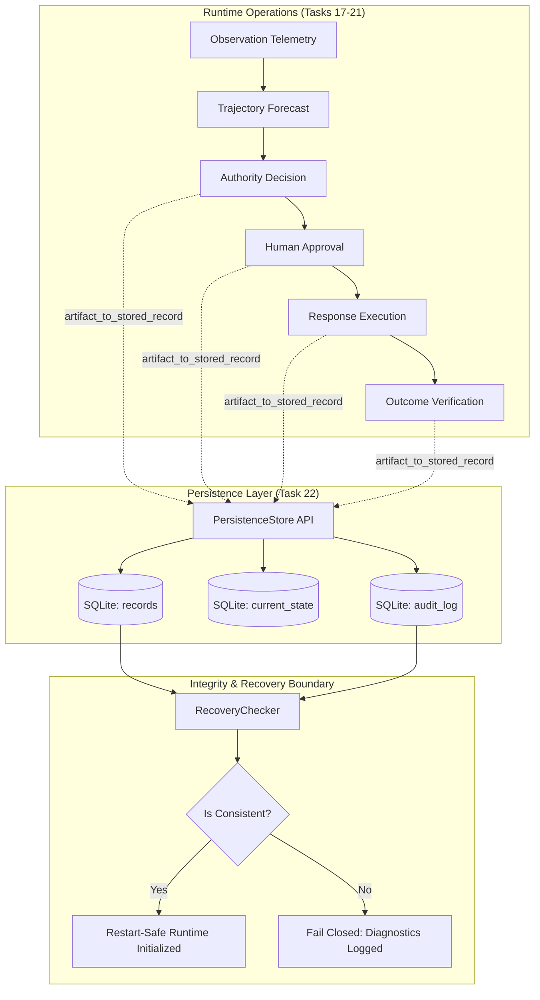
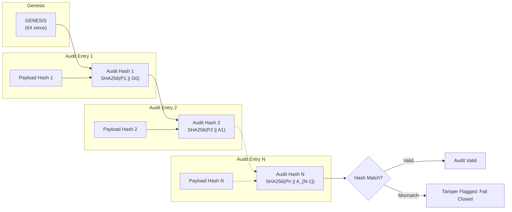

# Task 22: Persistence + Hardening Architecture

## Executive Summary

Task 22 establishes the **Persistence + Hardening Layer** for SIH PS 26153 (*AI-Based Network Attack Forecasting from Network Traffic Data*).

This subsystem provides local, transactional, durable, and tamper-aware persistence for all critical first-class artifacts produced across Tasks 17–21. It ensures that runtime state and audit artifacts survive process restarts, maintains idempotency, validates cross-reference integrity, and strictly fails closed under malformed data, partial writes, corrupted records, or schema evolution.

---

## 1. Core Architectural Separation: State vs. History

A central invariant of Task 22 is preserving the clear epistemic boundary between:

$$\mathbf{CURRENT\;STATE \neq AUDIT\;HISTORY \neq DERIVED\;ARTIFACTS \neq PROVENANCE}$$

| Category | Storage Entity | Semantics | Purpose |
| :--- | :--- | :--- | :--- |
| **Current State** | `current_state` table | Mutable pointer to canonical record ID per `RecordType`. | Fast retrieval of the active canonical assessment (e.g. latest `DemoEvent`, active `AuthorityDecision`). |
| **Audit History** | `audit_log` table | Sequential, append-only cryptographic hash chain. | Answers *"What happened?"* and *"In what order?"* without allowing historical mutation. |
| **Durable Records** | `records` table | Immutable key-value store indexed by `(record_type, record_id)`. | Answers *"What was believed and approved at that time?"* Preserves exact payloads. |
| **Provenance** | `provenance_hash` | Immutable SHA-256 cryptographic digests. | Verifies integrity and detects tampering across process lifecycles. |

---

## 2. Storage Backend: SQLite with WAL Mode

The storage engine is implemented by [`SQLitePersistenceStore`](file:///c:/Users/ayush/sih1/core/persistence/store.py), backed by Python's standard library `sqlite3`:

- **Zero External Server**: Requires no external database daemon (e.g., PostgreSQL, Redis, Kafka), eliminating operational fragility.
- **ACID Transaction Semantics**: Uses `BEGIN IMMEDIATE`, `COMMIT`, and `ROLLBACK` to guarantee atomic writes.
- **Write-Ahead Logging (`PRAGMA journal_mode = WAL;`)**: Allows concurrent reads while writes occur, eliminating read contention.
- **Foreign Key Enforcement (`PRAGMA foreign_keys = ON;`)**: Ensures referential integrity between current pointers and the records table.
- **Busy Timeout (`PRAGMA busy_timeout = 5000;`)**: Prevents immediate locking failures under bursty concurrency.

---

## 3. Explicit Security Boundary: Audit Invariant Enforcement

> [!IMPORTANT]
> **Formal Security Boundary**:
> 1. **Application/Store API Level**: The append-only audit invariant is strictly enforced at the application and store API level. The store exposes no `UPDATE` or `DELETE` methods for audit records. Internal SQLite triggers (`trg_audit_no_update`, `trg_audit_no_delete`) further reject modification statements within the database engine.
> 2. **Physical Filesystem Reality**: SQLite itself does **not** make the database file physically immutable against an adversary with host operating system or direct disk write access. An attacker with raw filesystem privileges can modify bytes on disk.
> 3. **Tamper Detection & Fail-Closed**: Any unauthorized modification to the database file is **detectable through canonical provenance hash verification and sequential audit-chain validation**.
> 4. **Formal Guarantee**: **Unauthorized modification is detectable and fails closed, not inherently impossible**.

---

## 4. Append-Only Cryptographic Audit Chain

Sequential audit entries are cryptographically linked using a SHA-256 hash chain:

$$\text{prev\_audit\_hash}_1 = \text{"0"}^{64} \quad (\text{GENESIS})$$
$$\text{payload\_hash}_n = \text{SHA256}(\text{canonical\_json}(\text{record}_n))$$
$$\text{audit\_hash}_n = \text{SHA256}(\text{payload\_hash}_n \parallel \text{prev\_audit\_hash}_n)$$

If any historical record is altered, inserted out of order, or deleted:
1. The link between $\text{prev\_audit\_hash}_{n+1}$ and $\text{audit\_hash}_n$ breaks.
2. The recomputed $\text{payload\_hash}_n$ diverges from $\text{record}_n$'s canonical representation.
3. [`verify_audit_chain()`](file:///c:/Users/ayush/sih1/core/persistence/store.py) and [`RecoveryChecker.check_store()`](file:///c:/Users/ayush/sih1/core/persistence/recovery.py) report explicit integrity anomalies and fail closed.

---

## 5. Serialization & Schema Versioning

All persistence serialization is handled by [`core/persistence/serializer.py`](file:///c:/Users/ayush/sih1/core/persistence/serializer.py):

- **No Python Pickle**: Pickle is permanently prohibited for security-sensitive artifacts due to arbitrary code execution risks.
- **Canonical JSON (`canonical_json_dumps`)**:
  - Keys are sorted alphabetically (`sort_keys=True`).
  - Separators are compact (`separators=(',', ':')`).
  - Floats are deterministically rounded to 4 decimal places (`round(v, 4)`).
  - Datetimes are normalized to timezone-aware ISO 8601 strings.
  - Enums serialize to their `.value` strings.
- **Explicit Schema Versioning**:
  - Every stored record carries `schema_version = 1`.
  - Future or unknown schemas (`schema_version > CURRENT_SCHEMA_VERSION`) raise [`UnsupportedSchemaError`](file:///c:/Users/ayush/sih1/core/persistence/serializer.py) and **fail closed**.
  - Missing or negative schema versions raise [`MissingSchemaVersionError`](file:///c:/Users/ayush/sih1/core/persistence/serializer.py) and **fail closed**.

---

## 6. Secret Redaction & Path Safety

### 6.1 Secret Redaction
[`redact_secrets()`](file:///c:/Users/ayush/sih1/core/persistence/serializer.py) recursively inspects data dictionaries prior to persistence:
- Sensitive key patterns (`password`, `secret`, `token`, `api_key`, `private_key`, `credential`, `auth_token`, `privkey`) have their values replaced with `"[REDACTED]"`.
- Plaintext secrets are never stored in the database or written to audit logs.

### 6.2 Path Safety
File operations in export and import routines invoke [`_sanitize_path()`](file:///c:/Users/ayush/sih1/core/persistence/store.py):
- Rejects empty strings and null bytes (`\x00`).
- Resolves paths using `os.path.abspath` to prevent directory traversal (`../`) attacks.

---

## 7. Cross-Reference Integrity Validation

[`RecoveryChecker.validate_cross_references()`](file:///c:/Users/ayush/sih1/core/persistence/recovery.py) enforces relational consistency across Tasks 17–21 artifacts:

```
[ResponseAction] ───────────────► [AuthorityDecision] (Must exist)
       │
       ├────────────────────────► [TopologySnapshot]  (Must exist if specified)
       │
       ▲
[HumanApproval] ────────────────► [ResponseAction]    (Must match action_id)
       │
       ├────────────────────────► [AuthorityDecision] (Must match action's auth_id)
       │
       └────────────────────────► evidence_window_id  (Must match action's window)
       ▲
       │
[ExecutionRecord] ──────────────► [ResponseAction]    (Must exist)
       │
       ├────────────────────────► [AuthorityDecision] (Must exist)
       │
       └────────────────────────► [HumanApproval]     (If EXECUTED, must be approved)

[OutcomeVerificationResult] ────► [ResponseAction]    (Must exist)

[OutcomeMismatchHandoff] ───────► [OutcomeVerificationResult] + [ResponseAction]

[BlastRadiusAssessment] ────────► [TopologySnapshot]  (Must exist)
```

If any referenced artifact is missing or binding tokens mismatch, the record is flagged as `orphaned` and dependent execution **fails closed**.

---

## 8. Artifact-Specific Persistence Semantics

1. **Reconsideration History (Task 17)**:
   - When reconsideration revises an assessment, both the prior assessment and the revised assessment are persisted within [`ReconsiderationEvent`](file:///c:/Users/ayush/sih1/security/reconsideration.py).
   - Historical assessments are never overwritten or deleted.
2. **Topology Snapshots (Task 18)**:
   - Persisted immutably in `records` under `RecordType.TOPOLOGY_SNAPSHOT`. Subsequent topology graph changes produce new snapshots with distinct IDs.
3. **Blast Radius Assessments (Task 19)**:
   - Persisted against the exact `topology_snapshot_id` used during evaluation.
4. **Authority Decisions (Task 20)**:
   - Persisted with policy version, exact evidence window ID, reason codes, and provenance hash.
5. **Response Execution & Outcome Verification (Task 21)**:
   - `ResponseAction`, `HumanApproval`, `ExecutionRecord`, `OutcomeVerificationResult`, and `OutcomeMismatchHandoff` are stored with their bindings.
   - Execution status is never reconstructed from volatile adapter state; it is loaded directly from durable `ExecutionRecord`s.

---

## 9. Idempotency & Restart Guarantees

- **Idempotent Insertion**: Attempting to insert an identical record into `records` succeeds cleanly without error or state mutation.
- **Conflict Detection**: Attempting to insert a record with an existing `(record_type, record_id)` but different payload raises [`DuplicateRecordConflictError`](file:///c:/Users/ayush/sih1/core/persistence/store.py).
- **Restart Idempotency**: After process restart, reloading the store confirms whether an action has already executed, preventing duplicate replay attacks.

---

## 10. Startup Recovery & Diagnostics

[`RecoveryChecker.check_store()`](file:///c:/Users/ayush/sih1/core/persistence/recovery.py) executes a comprehensive health check on store startup:
- Validates all schema versions.
- Re-verifies all record payload hashes and provenance hashes.
- Validates all cross-reference integrity constraints.
- Verifies the cryptographic continuity of the sequential audit chain.
- Produces a structured [`RecoveryReport`](file:///c:/Users/ayush/sih1/core/persistence/models.py) with explicit error diagnostics.
- **Anti-Silent Repair**: Never silently modifies or attempts to repair corrupted audit history; reports explicit anomalies and fails closed.

---

## 11. Deterministic Audit Export Bundle

[`export_audit_bundle()`](file:///c:/Users/ayush/sih1/core/persistence/store.py) and [`import_audit_bundle()`](file:///c:/Users/ayush/sih1/core/persistence/store.py) enable portable, offline audit verification:
- Bundle includes all records sorted deterministically by `(record_type, record_id)` and sequential audit entries.
- Stamped with `bundle_id`, `schema_version`, and a cryptographic `bundle_hash`.
- Importing a bundle verifies the bundle hash before inserting records into the destination store.

---

## 12. Architecture Diagrams

### 12.1 Persistence & Recovery Architecture



### 12.2 Append-Only Audit Chain & Tamper Detection Flow



---

## 13. Limitations & Task 23 Boundary

- **Local Storage Scope**: Task 22 provides single-node durability. It does not implement multi-region distributed consensus (Raft/Paxos).
- **Physical OS Boundary**: As documented, direct disk modification by an attacker with OS root/filesystem privileges is detectable and fails closed, not physically impossible.
- **Task 23 Red-Team Boundary**: Active fault injection, network severance, packet corruption, and degraded fail-safe fallback modes will be hardened in Task 23.
