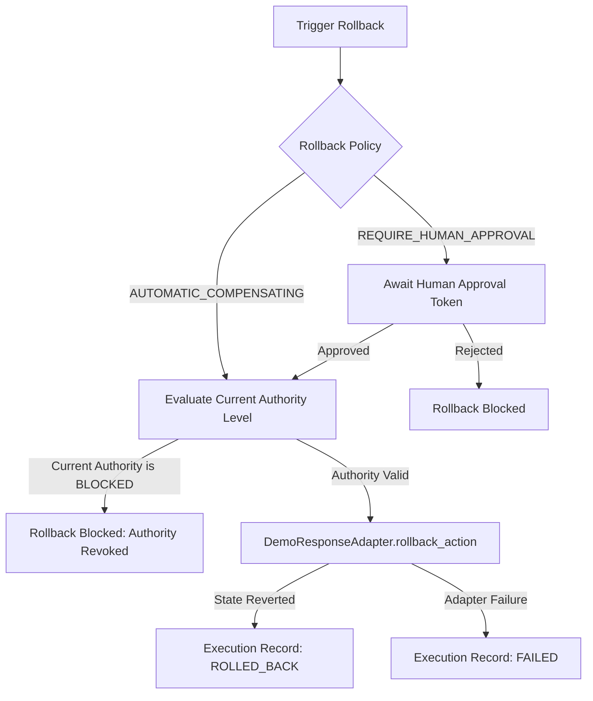

# Task 21: Reversible Response Execution & Outcome Verification Architecture

## Executive Summary

Task 21 establishes the **Reversible Response Execution & Outcome Verification Layer** for the SIH PS 26153 system (*AI-Based Network Attack Forecasting from Network Traffic Data*).

This subsystem bridges the gap between **strategic policy governance** (Tasks 18–20: Topology, Blast Radius, and Confidence $\to$ Authority Policy) and **closed-loop feedback** (Task 17: Reconsideration & Trajectory Revision).

---

## 1. Foundational Axiom: Strict Separation of Responsibilities

A core safety invariant of this platform is that **recommendation does not imply authorization, and authorization does not imply execution**:

$$\text{RECOMMENDATION} \neq \text{AUTHORIZATION} \neq \text{APPROVAL} \neq \text{EXECUTION} \neq \text{VERIFICATION}$$

| Stage | Subsystem | Responsibility | Invariant |
| :--- | :--- | :--- | :--- |
| **1. Recommendation** | `ResponseRecommendationEngine` (Task 1) | Recommends tactical mitigations based on behavioral security forecast. | Advisory only. Has zero execution authority. |
| **2. Authorization** | `AuthorityPolicyEngine` (Task 20) | Constrains permissible actions based on epistemic trust, uncertainty, and topology state. | Sets authority ceiling (`OBSERVE`, `ALERT`, `RECOMMEND`, `HUMAN_APPROVAL_REQUIRED`, `BLOCKED`). High risk $\neq$ high authority. |
| **3. Approval** | `HumanApproval` (Task 21) | Explicit, signed authorization from a qualified human operator bound to exact decision tokens. | **Strictly mandatory** for all active response execution. No automated system, trust score, or risk urgency can bypass human approval. |
| **4. Execution** | `ResponseExecutor` + `DemoResponseAdapter` (Task 21) | Executes approved reversible actions against simulated in-memory infrastructure adapters. | Pure simulation; zero OS/firewall modifications. Evaluates an 8-step pre-execution safety gate. |
| **5. Verification** | `OutcomeVerifier` (Task 21) | Inspects subsequent telemetry to verify whether the executed action produced the predicted effect. | Fails closed on missing telemetry (`INSUFFICIENT_EVIDENCE`). Outcome mismatches generate handoffs to Task 17 Reconsideration without synthetic score fabrication. |

---

## 2. Reversible Action Primitives & Rollback Policies

### 2.1 Reversible Action Types

All actionable countermeasures in Task 21 are **strictly reversible** and modeled via the `ReversibleActionType` enumeration:

1. **`RATE_LIMIT_IP`**: Temporarily limits connection/packet rates from a suspect IP address or CIDR range.
2. **`TEMPORARY_BLOCK_IP`**: Temporarily drops traffic from an aggressive source IP for a bounded TTL.
3. **`ISOLATE_SERVICE_ENDPOINT`**: Temporarily isolates a specific service port, path, or endpoint without terminating the underlying container/host.
4. **`REROUTE_SUSPECT_TRAFFIC`**: Diverts suspicious telemetry flows to an inspection sink or rate-limited mitigation lane.
5. **`STEP_UP_CHALLENGE`**: Injects cryptographic or proof-of-work authentication challenges for inbound connections.

> [!CAUTION]
> **Permanent Prohibition on Destructive Actions**: Actions classified as `EXECUTE_DESTRUCTIVE_ACTION` (e.g., node termination, permanent iptables drops, disk wipes, routing table purging) are **permanently blocked** and cannot be represented as `ReversibleActionType`. Any attempt to execute a destructive action raises a hard rejection at the first gate.

### 2.2 Rollback Governance & Policies

Rollback is treated as a **first-class, controlled action**, not an implicit privileged bypass:

```python
class RollbackPolicy(str, Enum):
    AUTOMATIC_COMPENSATING = "AUTOMATIC_COMPENSATING"
    REQUIRE_HUMAN_APPROVAL = "REQUIRE_HUMAN_APPROVAL"
```

1. **Authority-Gated Rollback**: Rollbacks must respect current Task 20 authority. If the current authority decision for the target node is `BLOCKED`, rollback cannot proceed.
2. **Policy Enforcement**: If `RollbackPolicy.REQUIRE_HUMAN_APPROVAL` is set, an explicit `HumanApproval` object bound to the rollback action is mandatory.
3. **Targeted State Inversion**: Reversible adapters apply exact inverse operations (e.g., removing a rate limit, clearing an IP block entry, restoring normal routing).
4. **Deterministic Auditing**: Every rollback generates an immutable `ExecutionRecord` marked with `ExecutionStatus.ROLLED_BACK` (or `FAILED` if adapter reverts fail).

---

## 3. Data Models & Provenance Integrity

The data models in [`core/response_execution/models.py`](file:///c:/Users/ayush/sih1/core/response_execution/models.py) are immutable (`frozen=True`) dataclasses:

### 3.1 `ResponseAction`
```python
@dataclass(frozen=True)
class ResponseAction:
    action_id: str
    action_type: ReversibleActionType
    target_node_id: str
    action_class: ActionClass
    authority_decision_id: str
    evidence_window_id: str
    rollback_policy: RollbackPolicy
    target_ip: str | None = None
    target_port: int | None = None
    rate_limit_ratio: float = 0.5
    ttl_seconds: int = 300
    rollback_parameters: dict[str, Any] = field(default_factory=dict)
    topology_snapshot_id: str | None = None
    provenance_hash: str = ""
```
- Bound to exact `authority_decision_id`, `evidence_window_id`, and `topology_snapshot_id`.
- Computes deterministic SHA-256 hash over all functional fields.

### 3.2 `HumanApproval`
```python
@dataclass(frozen=True)
class HumanApproval:
    approval_id: str
    action_id: str
    authority_decision_id: str
    evidence_window_id: str
    approver_reference: str
    approved: bool
    rationale: str
    approved_at_iso: str = ""
    provenance_hash: str = ""
```
- Cryptographically binds the operator's approval to the specific action ID, authority decision ID, and evidence window ID.
- Mismatched tokens immediately fail closed.

### 3.3 `ExecutionRecord`
```python
@dataclass(frozen=True)
class ExecutionRecord:
    execution_id: str
    action_id: str
    authority_decision_id: str
    evidence_window_id: str
    status: ExecutionStatus  # PENDING, EXECUTED, FAILED, ROLLED_BACK, BLOCKED, REJECTED
    applied_parameters: dict[str, Any]
    approval_id: str | None = None
    executed_at_iso: str = ""
    rolled_back_at_iso: str | None = None
    error_message: str | None = None
    provenance_hash: str = ""
```

---

## 4. Pre-Execution Safety Invariants: The 8-Gate Pipeline

Before executing any action, [`ResponseExecutor`](file:///c:/Users/ayush/sih1/core/response_execution/executor.py) enforces 8 sequential, fail-closed safety checks:

```
[Candidate Action]
       │
       ▼
Gate 1: Destructive Action Check ───────────► (FAIL -> Blocked)
       │ Pass
       ▼
Gate 2: Authority Level Check ──────────────► (FAIL -> Blocked)
       │ Pass (AuthorityLevel != BLOCKED, OBSERVE, ALERT, RECOMMEND)
       ▼
Gate 3: Action Class Permission Check ──────► (FAIL -> Blocked)
       │ Pass (ActionClass in {EXECUTE_REVERSIBLE_ACTION, PREPARE_REVERSIBLE_ACTION})
       ▼
Gate 4: Action <-> Authority Binding ───────► (FAIL -> Blocked)
       │ Pass (action.authority_decision_id == authority_decision.decision_id)
       ▼
Gate 5: Human Approval Verification ────────► (FAIL -> Blocked / Rejected)
       │ Pass (approved == True, action_id, decision_id, window_id match)
       ▼
Gate 6: Stale-Authorization Verification ───► (FAIL -> Blocked: STALE_AUTHORIZATION)
       │ Pass (current_window_id == action.evidence_window_id)
       ▼
Gate 7: Topology Revalidation ──────────────► (FAIL -> Blocked: TOPOLOGY_MISMATCH)
       │ Pass (status != UNAVAILABLE, snapshot_id matches, target node exists)
       ▼
Gate 8: Idempotency Check ──────────────────► (Already Executed -> Return existing record)
       │ New Execution
       ▼
[Invoke ResponseAdapter.apply_action()]
```

### Deterministic Stale-Authorization Revalidation

Unlike brittle, speculative "risk drift" heuristics, stale-authorization detection in Task 21 is **strictly deterministic**:
1. **Evidence Window Binding**: The action is stamped with `action.evidence_window_id`. If live telemetry advances before execution (`current_window_id != action.evidence_window_id`), the decision is classified as stale:
   `STALE_AUTHORIZATION_SUPERSEDED_BY_NEW_EVIDENCE`
2. **Topology Availability Check**: If the system's topology status transitioned to `TopologyAvailability.UNAVAILABLE`, the action fails closed:
   `STALE_AUTHORIZATION_TOPOLOGY_UNAVAILABLE`
3. **Topology Snapshot Binding**: If a new topology snapshot was registered (`current_topology.snapshot_id != action.topology_snapshot_id`), the action fails closed:
   `STALE_AUTHORIZATION_TOPOLOGY_SNAPSHOT_MISMATCH`
4. **Target Node Liveness**: If the target service node no longer exists in the active topology graph, the action fails closed:
   `STALE_AUTHORIZATION_TARGET_NODE_MISSING`

When any stale authorization condition occurs, execution is blocked, and the system requires a fresh authority evaluation and fresh human approval.

---

## 5. Safe Simulation & In-Memory Adapter

To strictly satisfy the safety requirements of SIH PS 26153, [`DemoResponseAdapter`](file:///c:/Users/ayush/sih1/core/response_execution/adapters.py) implements the [`ResponseAdapter`](file:///c:/Users/ayush/sih1/core/response_execution/adapters.py) interface with zero host-level or network-level modifications:

- **State Storage**: Pure Python in-memory dictionaries (`_active_rate_limits`, `_blocked_ips`, `_isolated_endpoints`, `_rerouted_flows`, `_step_up_challenges`).
- **No Side Effects**: Never executes system shell commands, never calls Windows firewall or `iptables`, never terminates operating system processes, and never modifies routing tables.
- **Configurable Fault Injection**: Supports `fail_on_action_id` and `fail_on_rollback_id` to verify adapter error handling deterministically.
- **Full Inversion on Rollback**: Every applied action records its inverse parameters, allowing complete state unwinding.

---

## 6. Outcome Verification & Closed-Loop Feedback

### 6.1 Outcome Expectations

An executed action is paired with an [`OutcomeExpectation`](file:///c:/Users/ayush/sih1/core/response_execution/verification.py):
- **`target_metric`**: Name of the telemetry metric expected to change (e.g., `"syn_ratio"`, `"churn_rate"`, `"packet_rate"`).
- **`comparison_operator`**: Evaluation operator (`DROP_BY_PERCENT`, `LESS_THAN`, `LESS_THAN_OR_EQUAL`, `WITHIN_RANGE`).
- **`baseline_value`**: Pre-mitigation value of the metric.
- **`expected_value` / `expected_drop_percent`**: Targeted post-mitigation threshold.
- **`grace_period_windows`**: Number of observation windows allowed before impact must manifest.

### 6.2 Fail-Closed Missing Evidence Invariant

If the subsequent observation window lacks data for `target_metric`, [`OutcomeVerifier`](file:///c:/Users/ayush/sih1/core/response_execution/verification.py) **strictly fails closed**:
- Status is set to `VerificationStatus.INSUFFICIENT_EVIDENCE`.
- Missing data is **never** conflated with successful mitigation.

### 6.3 Closed-Loop Handoff to Task 17 Reconsideration

When an action is executed but the observed outcome fails to meet expectations (e.g., SYN ratio remains high after IP rate limiting), the verifier produces an [`OutcomeMismatchHandoff`](file:///c:/Users/ayush/sih1/core/response_execution/verification.py):

> [!IMPORTANT]
> **No Synthetic Risk Score Fabrication**:
> The `OutcomeVerifier` does **not** invent or synthesize a revised risk score, priority, or trust number.
> Instead, it emits an `OutcomeMismatchHandoff` containing the exact empirical discrepancy. This handoff feeds directly into the existing Task 17 **Reconsideration Engine**, which re-runs the canonical forecasting pipeline to produce genuine revised assessments.

---

## 7. Architecture Diagrams

### 7.1 Full Action Lifecycle: Recommendation to Verification

```mermaid
flowchart TD
    subgraph S1["1. Behavioral Security Pipeline (Tasks 1-16)"]
        A[Network Telemetry] --> B[NetworkState]
        B --> C[AR(5) Trajectory Forecast]
        C --> D[Future Security Risk Engine]
        D --> E[Response Recommendation Engine]
    end

    subgraph S2["2. Strategic Authority Governance (Tasks 18-20)"]
        E -->|Candidate Mitigation| F[Authority Policy Engine]
        G[Service Topology Graph] --> H[Blast Radius Engine]
        H --> F
        I[Trust & Uncertainty Contract] --> F
        F -->|Authority Decision| J{Authority Level}
    end

    subgraph S3["3. Operational Execution Layer (Task 21)"]
        J -->|BLOCKED / ADVISORY| K[Execution Forbidden: Advisory Only]
        J -->|HUMAN_APPROVAL_REQUIRED| L[Human Operator Review]
        L -->|Reject| M[Execution Status: REJECTED]
        L -->|Approve| N[Signed HumanApproval Token]
        N --> O[Response Executor 8-Gate Pipeline]
        O -->|Stale Window / Topo Changed| P[Blocked: STALE_AUTHORIZATION]
        O -->|Validation Succeeded| Q[DemoResponseAdapter]
        Q -->|Simulated Inversion Parameters| R[Execution Record: EXECUTED]
    end

    subgraph S4["4. Outcome Verification & Closed-Loop (Task 21 & Task 17)"]
        R --> S[Post-Mitigation Telemetry Window]
        S --> T[Outcome Verifier]
        T -->|Target Metric Met| U[Verification Status: VERIFIED_SUCCESS]
        T -->|Missing Telemetry| V[Verification Status: INSUFFICIENT_EVIDENCE]
        T -->|Target Metric Not Met| W[Verification Status: VERIFIED_MISMATCH]
        W --> X[OutcomeMismatchHandoff]
        X -->|Closed Loop| Y[Task 17 Reconsideration Engine]
        Y -->|Pipeline Recalculation| C
    end
```

### 7.2 Controlled Rollback Lifecycle



---

## 8. Integration with `DemoEvent` and SSE Stream

Task 21 is integrated additively into the central SSE demonstration stream via [`scenarios/demo/engine.py`](file:///c:/Users/ayush/sih1/scenarios/demo/engine.py):

```python
@dataclass
class DemoEvent:
    ...
    response_execution: dict[str, Any] | None = None
    outcome_verification: dict[str, Any] | None = None
```

- When an action is executed or verified, its serializable dictionary payload (`to_dict()`) is attached to `DemoEvent`.
- Existing SSE consumers receive the new fields additively without breaking schema compatibility or existing event listeners.

---

## 9. Verification & Test Suite Summary

The Task 21 implementation is backed by **32 dedicated tests** across two comprehensive test suites:

1. [`tests/test_response_execution.py`](file:///c:/Users/ayush/sih1/tests/test_response_execution.py) (23 tests):
   - Valid approved action execution
   - Missing approval blocks execution
   - Explicit human rejection handling
   - Authority level `BLOCKED` and advisory levels (`OBSERVE`, `ALERT`, `RECOMMEND`) prevention
   - Permanent block on destructive actions
   - Action $\leftrightarrow$ authority mismatch detection
   - Approval $\leftrightarrow$ action, authority, and evidence window mismatch detection
   - Deterministic stale-authorization revalidation (superseded evidence window)
   - Topology `UNAVAILABLE` revalidation
   - Topology snapshot mismatch revalidation
   - Missing target node in topology revalidation
   - Idempotency guarantees
   - Adapter failure handling
   - Controlled rollback success, authority-gated rollback blocking, and policy-governed rollback approval
   - Invariant: high risk and priority cannot bypass human approval
   - Provenance hash determinism and full model serialization roundtrips

2. [`tests/test_outcome_verification.py`](file:///c:/Users/ayush/sih1/tests/test_outcome_verification.py) (9 tests):
   - Expected metric drop verified success
   - Metric drop absent verified mismatch
   - Absolute threshold comparisons (`LESS_THAN`, `LESS_THAN_OR_EQUAL`)
   - Fail-closed behavior on missing telemetry (`INSUFFICIENT_EVIDENCE`)
   - Dictionary telemetry format handling
   - `OutcomeMismatchHandoff` generation for Task 17 without synthetic risk scores
   - Verification provenance hash determinism
   - **Full 10-step end-to-end lifecycle chain**: Forecast $\to$ Risk $\to$ Recommendation $\to$ Authority $\to$ Approval $\to$ Execution $\to$ Verification $\to$ Controlled Rollback

**Regression Suite Result**: **389 tests passed, 0 failures, 0 errors** across all Tasks 1–21.
