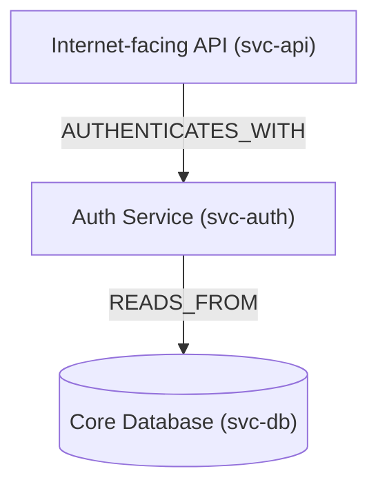
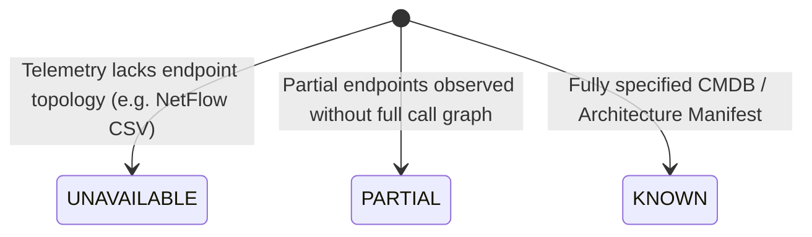
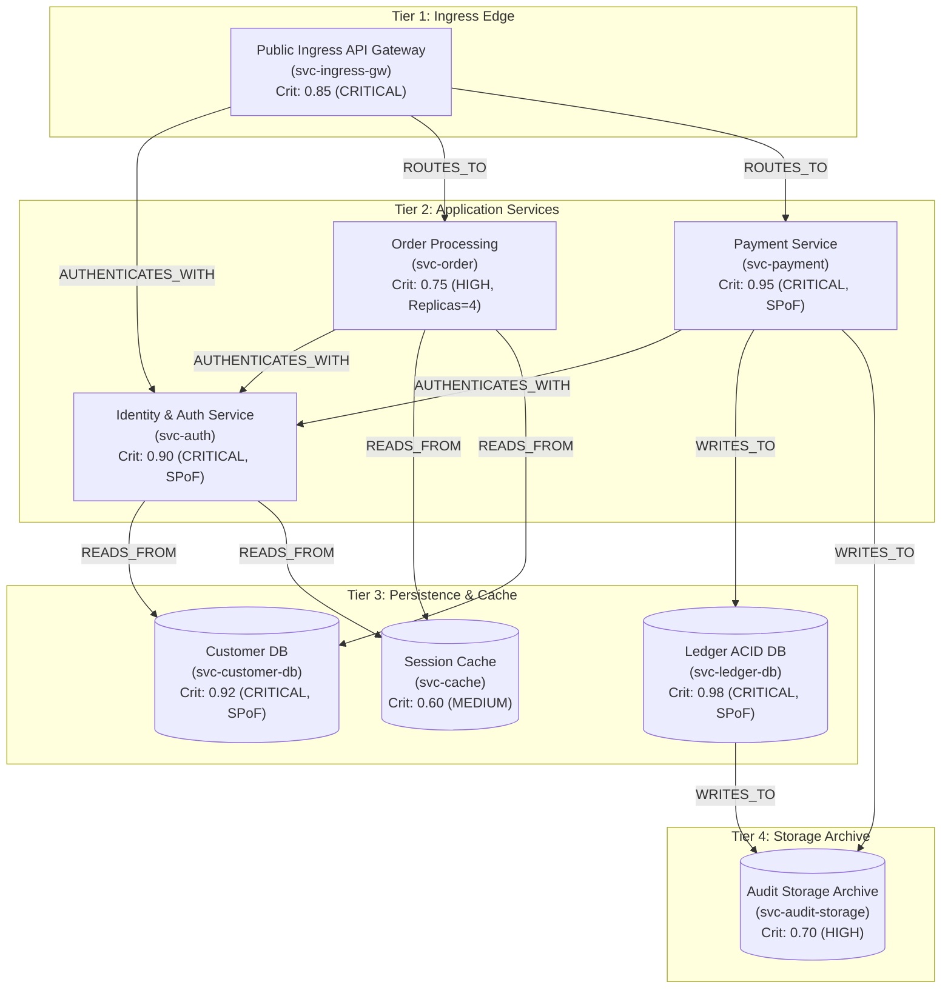

# Service Topology & Dependency Graph Architecture (Task 18)

## 1. Executive Summary

Task 18 establishes a first-class **Service Topology / Dependency Graph** layer within the SIH PS 26153 intelligence pipeline. 

The primary purpose is to provide the security decision layer with **structural context**:
- What services or assets depend on a compromised or anomalous node?
- What upstream dependencies does that service rely upon to function?
- What are the multi-hop dependency chains across infrastructure tiers?
- Which critical services represent single points of failure (SPoF)?

```
┌─────────────────────────────────────────────────────────────┐
│                 Security Intelligence Stack                 │
│  (NetworkState → AR(5) → Signatures → Risk → Priority)     │
└──────────────────────────────┬──────────────────────────────┘
                               │
                               ▼
┌─────────────────────────────────────────────────────────────┐
│                 Service Topology Context                    │
│      (Nodes, Directed Dependencies, Criticality, Tiers)     │
└──────────────────────────────┬──────────────────────────────┘
                               │
                               ▼ (Task 19)
┌─────────────────────────────────────────────────────────────┐
│             Containment Safety & Blast Radius               │
│        (Safe Isolation, Replica Checks, Downgrades)         │
└─────────────────────────────────────────────────────────────┘
```

> [!IMPORTANT]
> **Strict Boundary Constraint**: Task 18 establishes topology representation and traversal capabilities only. It **does not** compute blast-radius impact scores, outage percentages, or automated containment actions. Those capabilities are strictly deferred to Task 19.

---

## 2. Architectural Principles

### 2.1 Topology is a Separate Concern
Topology graph logic is encapsulated in a dedicated package:
```
core/topology/
    models.py      # Immutable boundary contracts (ServiceNode, DependencyEdge, Snapshot)
    graph.py       # ServiceTopologyGraph (adjacency store, cycle-safe traversals)
    builder.py     # Deterministic topology builders (Demo, Enterprise, Unavailable)
```
Existing components (`ARStyleBaselineV2`, `BehavioralSecurityBridge`, `SecurityRiskEngine`, `PriorityEngine`, `ResponseRecommendationEngine`, `ReconsiderationEngine`) remain behaviorally unchanged and frozen.

### 2.2 Directed Dependency Semantics
Dependencies are strictly directional:
$$\text{source\_id} \xrightarrow{\text{DEPENDS\_ON}} \text{target\_id}$$



Under these exact semantics:
- $\text{dependencies}(\text{API}) = \{\text{Auth}\}$
- $\text{dependencies}(\text{Auth}) = \{\text{Database}\}$
- $\text{dependents}(\text{Database}) = \{\text{Auth}, \text{API}\}$
- $\text{dependents}(\text{Auth}) = \{\text{API}\}$

### 2.3 Cycle Safety (Non-DAG Graphs)
Real enterprise service architectures frequently contain feedback loops, mutual health probes, or cyclical dependencies (e.g. $A \to B \to C \to A$).
- The topology engine **never assumes the graph is an acyclic DAG**.
- Traversal routines employ visited sets to guarantee safe termination without infinite recursion.
- Cycle detection (`has_cycle()`) and cycle path extraction (`find_cycles()`) are natively supported.

### 2.4 Explicit Availability & Anti-Fabrication Mandate
Per Task 15's foundational rule:
> *“Unavailable topology must remain unavailable. Never fabricate topology information.”*

Telemetry sources such as CSE-CIC-IDS2018 NetFlow CSV flow records lack internal host endpoint identifiers and inter-service call graphs. In such contexts, topology is explicitly marked `UNAVAILABLE` rather than guessing or fabricating synthetic enterprise relationships.



---

## 3. Data Models (`core/topology/models.py`)

### 3.1 `ServiceNode`
An immutable, validated representation of a network asset or service:

| Field | Type | Description |
|---|---|---|
| `node_id` | `str` | Unique, stable identifier (e.g. `"svc-auth"`) |
| `name` | `str` | Human-readable service name (e.g. `"Identity & Token Auth"`) |
| `service_type` | `ServiceType` | Service category (`GATEWAY`, `API`, `AUTH`, `DATABASE`, `CACHE`, etc.) |
| `criticality` | `float` | Continuous criticality score in $[0.0, 1.0]$ |
| `criticality_level` | `CriticalityLevel` | Categorical level (`CRITICAL`, `HIGH`, `MEDIUM`, `LOW`, `INFO`) |
| `tier` | `str` | Operational tier (`"edge"`, `"application"`, `"data"`, etc.) |
| `metadata` | `Mapping[str, Any]` | Redundancy flags (`has_replica`, `single_point_of_failure`) |
| `provenance_source` | `str` | Authoritative source (`"cmdb"`, `"config"`, `"telemetry"`) |
| `provenance_hash` | `str` | SHA-256 canonical integrity hash |

### 3.2 `DependencyEdge`
An immutable directed edge representing a dependency:

| Field | Type | Description |
|---|---|---|
| `source_id` | `str` | The dependent service (who depends on target) |
| `target_id` | `str` | The dependency service (who is depended upon) |
| `relationship_type` | `DependencyType` | Relationship (`DEPENDS_ON`, `CALLS`, `AUTHENTICATES_WITH`, etc.) |
| `confidence` | `float` | Confidence score in $[0.0, 1.0]$ |
| `provenance_source` | `str` | Source of relationship discovery |
| `provenance_hash` | `str` | SHA-256 canonical integrity hash |
| `metadata` | `Mapping[str, Any]` | Protocol or operational metadata |

### 3.3 `TopologySnapshot`
An immutable audit snapshot capturing the exact graph state at logical time $T$, including node/edge counts, deterministic serialization, and a SHA-256 content verification hash.

---

## 4. Query & Traversal Engine (`core/topology/graph.py`)

The `ServiceTopologyGraph` provides the following query APIs:

```python
# Direct single-hop queries
graph.get_dependencies(node_id: str) -> list[str]
graph.get_dependents(node_id: str) -> list[str]

# Multi-hop transitive queries (cycle-safe, deterministic)
graph.get_transitive_dependencies(node_id: str) -> list[str]
graph.get_transitive_dependents(node_id: str) -> list[str]

# Path exploration
graph.get_dependency_chain(source_id: str, target_id: str) -> list[list[str]]

# Cycle inspection
graph.has_cycle() -> bool
graph.find_cycles() -> list[list[str]]
```

### Determinism Guarantees
1. **Sorted Expansion**: At every step of BFS / DFS traversal, neighbor nodes are expanded in lexicographical order by `node_id`.
2. **Deterministic Serialization**: `to_dict()` and `to_snapshot()` sort all nodes by `node_id` and all edges by `(source_id, target_id, relationship_type)`.
3. **Idempotence**: Duplicate node or edge insertions update existing records in place without altering list lengths or ordering.

---

## 5. Enterprise Reference Topology (`core/topology/builder.py`)

A realistic 4-tier enterprise microservices topology is provided for demo replay and verification:



---

## 6. Pipeline Integration & Backward Compatibility

### Minimal Additive Integration
1. `DemoEvent` in `scenarios/demo/engine.py` receives an optional field:
   ```python
   topology_context: dict[str, Any] | None = None
   ```
2. `LiveDemoEngine` accepts an optional `topology: ServiceTopologyGraph | None = None`.
3. When `topology` is provided, `event.topology_context` serializes the current graph status without altering risk, priority, or recommendations.
4. When `topology` is `None` (the default), `topology_context` remains `None`.

### Invariance Verification
Empirical testing (`tests/test_topology.py::test_17_topology_does_not_silently_alter_risk_or_priority`) proves that executing a demo scenario with full topology attached produces:
- Identical `current_risk_score` (within $10^{-5}$)
- Identical `future_risk_scores` across all horizons
- Identical `priority_level` and `composite_priority`
- Identical `recommended_strategy` and `recommended_actions`
- Identical `primary_stage` and `composite_trust`

---

## 7. Roadmap to Task 19 (Containment Safety & Blast Radius)

Task 18 strictly establishes the graph representation and traversal interface.
Task 19 will consume this interface to implement:

1. **Blast-Radius Computation**:
   Query `graph.get_transitive_dependents(candidate_node)` to identify all downstream services that would lose connectivity if `candidate_node` were isolated.
2. **Containment Safety Gate**:
   Check metadata on candidate and dependent nodes (`single_point_of_failure`, `has_replica`, `read_only_fallback`).
3. **Automated Containment Downgrades**:
   If isolating a database (e.g. `svc-ledger-db`, criticality 0.98, SPoF=True) would cause catastrophic cascading outages across `svc-payment` and `svc-ingress-gw`, downgrade the recommended response from destructive node quarantine to targeted rate-limiting or egress blocking.
