# Control Centre — Unified Implementation Walkthrough (Part 1 + Part 2 + Motion Pass)

The Stitch-generated frontend prototype has been unified into a production React + TypeScript application with exact visual fidelity to the original design and enhanced motion physics.

---

## 1. Design System, Visual Tokens & Motion Physics

### Design System & Visual Tokens
- **Canvas Base**: Pure `#000001`
- **Surfaces**: `#080808` (panel floor), `#111111` (elevated module), `#181818` (high-interact active)
- **Grid & Borders**: Hairline `#262626` (bento grid) and `#353535` (module borders)
- **Sole Accent**: `#F0C808` (cyber yellow for active paths, confidence meters, unread bars, status badges)
- **Typography**: Complete scale with `Hanken Grotesk` (display, headlines, titles, body) and `JetBrains Mono` (labels, metadata, event dumps)
- **Zero-Radius Reset**: Hard rule `* { border-radius: 0 !important; }` enforced across all components

### Motion Pass Physics & Keyframes
- **Easing Curve**: `--ease-out-expo: cubic-bezier(0.19, 1, 0.22, 1)`
- **Data Stream Scanner**: Luminous `#F0C808` horizontal laser line sweeping vertically (`@keyframes scan`)
- **Typing Log Feed**: Live character typewriter effect for critical intelligence events (`.typing-effect`)
- **Breathing SVG Nodes**: Biological pulse animations on topological graph nodes (`.breathe-node`, `.breathe-active-node`)
- **Dash Flow Animation**: Flowing dashed connection lines between network nodes (`.dash-flow-anim`)
- **Interactive Focus Flash**: Highlight pulses on audit scenarios and newly streamed logs (`.animate-focus-flash`, `.animate-feed-stream`)

---

## 2. Integrated Feature Matrix

```mermaid
graph TD
    A[Global TopAppBar / ⌘K Palette / Notification Drawer] --> B[Overview Dashboard]
    A --> C[Investigation Workspace]
    A --> D[Entity Explorer]
    A --> E[Evidence Intelligence]
    A --> F[Alerts & Review Queue]
    A --> G[System Health & Audit]
    A --> H[Settings & Access Control]
    A --> I[Operational Simulation]

    I --> I1[Engine Vitality & Observability Drop]
    I --> I2[Live Command Log Feed Stream]
    I --> I3[Attack Signal & Authority Demotion]
    I --> I4[Human Review Required Modal]

    G --> G1[Live Scanner Data Stream]
    G --> G2[Impact Propagation Graph]
    G --> G3[Degraded / Critical / Recovery Simulation]

    C --> C1[Global Context Breadcrumbs]
    C --> C2[Second-Degree Graph Expansion]
    C --> C3[Multi-Stage Path Controller]
    C --> C4[Forensic Provenance & Raw JSON Viewer]

    E --> E1[Evidence Drill-Down]
    E --> E2[Conflict Analysis & -11% Alert]
    E --> E3[7-Step Provenance Chain]
    E --> E4[Analyst Review Console]

    H --> H1[Identity Parameters & MFA]
    H --> H2[User Registry Directory]
    H --> H3[Role Permissions Matrix]
    H --> H4[Active Session Revocation]
```

---

## 3. Screen-by-Screen Breakdown

### 1. Operational Simulation (`/command-center/simulation`)
- **Simulation Control Strip**: `SIMULATION MODE: ACTIVE` (with glowing yellow badge), `RESET`, `STEP`, `PAUSE`, `START SIMULATION`.
- **State Machine Replay**:
  - Phase 1: Attack Signal detected (`ANOMALOUS DATA EXFILTRATION` with `#F0C808` border flash, focused evidence ledger entry `EV-00421`).
  - Phase 2: Telemetry loss on Node 09, Observability drop from `94%` → `61%` (in error red), State transition to `MITIGATION`, Authority demoted to `LIMITED`.
  - Phase 3: Autonomous authority `SUSPENDED`, Human Review modal triggered.
- **Human Review Overlay**: High-contrast emergency modal requiring operator intervention to resume autonomous authority.

### 2. System Health & Motion Matrix (`/command-center/system`)
- **Engine Vitality**: Confidence score (91%), active protocol status (`THREAT_ATTRIBUTION ACTIVE`, `PATTERN_RECOGNITION ACTIVE`, `ARCHIVE_SYNC IDLE`).
- **Data Stream Scanner**: Live sweeping laser line with historical logs, active luminous alerts, and typewriter log entries (`MATCH_FOUND: THREAT_ACTOR_04 (CONFIDENCE: 92%)`).
- **Impact Propagation SVG Graph**: Dynamic SVG topology with pulsating nodes (`NODE_01`, `NODE_14`, `NODE_22`, `NODE_250 ISOLATED`), animated dashed edges, and real-time review queue status.

### 3. Investigation Workspace (`/command-center/investigations`)
- **Global Context Breadcrumbs**: `CASE-024 // SUBJECT: CIPHERNINE // RELATIONSHIP: C9-SECURE.NET // CONFIDENCE: 87%`.
- **Second-Degree Graph Expansion**: Floating bottom-left controller (`DEPTH: 2`, `REL: 14`, `NEW: 06`, `EXPAND`/`COLLAPSE`, filter chips `ID`, `INFRA`, `BEH`, `CRYP`), second-degree nodes (`SSL CERTIFICATE`, `MAIL SERVER`, `ALIAS: 'DARKPINE'`), and golden active path edges.
- **Multi-Stage Path Controller**: Stage breadcrumbs (`IDENTITY` → `PGP` → `DOMAIN` → `INFRA`), active stage metadata, and analytical metrics (`SUPPORTING: 08`, `CONFLICTING: 01`, `UNRESOLVED: 02`).
- **Forensic Drawer & Technical Raw Data Viewer**: 7 vertical step selectors and live formatted JSON payload viewer with normalized signal dictionary.

### 4. Evidence Drill-Down & Conflict Analysis (`/command-center/evidence`)
- **Header & Quick Navigation**: `EV-00421 | INFRASTRUCTURE CORRELATION | CASE-024` with `VIEW ENTITY`, `VIEW RELATIONSHIP`, and `VIEW AUDIT` actions.
- **4-Stat KPI Grid**: `89 PACKETS`, `1.2G VOLUME`, `4 HOPS`, `12s DURATION`.
- **Conflict Analysis**: Supporting Signals vs Conflicting Signals (`EV-00403 (PGP ASSOCIATION)`: Temporal mismatch detected with `-11% CONFIDENCE` alert).
- **7-Step Provenance Chain**: `SOURCE` → `COLLECTION` → `NORMALIZATION` → `EXTRACTION` → `CORRELATION` → `CASE ASSIGNMENT` → `ATTRIBUTION`.
- **Analyst Review Console**: Findings textarea, `MARK CONFLICTING`, `REQUEST MORE EV`, `ESCALATE`, and `ACCEPT EVIDENCE`.

### 5. Settings & Access Management (`/command-center/settings`)
- **Profile**: Identity parameters (`ANALYST_01`, `INVESTIGATOR`, `14:42 UTC`, `MFA_ACTIVE`), biometric security clearance level.
- **Access Control**: User Registry table (`ANALYST_01`, `REVIEWER_03`, `AUDITOR_09`, `ADMIN_ROOT`), Role Definition matrix (`ROLE: REVIEWER` ID: `ROL-992`), and Authorization Audit Log (Scenario A Authorized vs Scenario B Denied).
- **Active Sessions**: 4 metric cards (`ACTIVE SESSIONS: 3`, `CONCURRENT PEAK: 5`, `SECURITY SCORE: 98/100`, `MFA ENFORCED: 100%`), session registry table, and immediate `REVOKE` button.

---

## 4. Verification & Build Results

- **Production TypeScript Build**: `npm run build --prefix ui` compiled cleanly in 244ms with exit code `0`.
- **Zero Linter / Type Errors**: All modules strictly comply with `verbatimModuleSyntax`.
- **Dev Server**: Running on `http://localhost:5173/command-center`.
